# QualiAgent Architecture Overview

## 1. High-Level Summary

QualiAgent is a containerized, multi-service web application designed for qualitative data analysis. It follows a modern, decoupled architecture with a dedicated frontend for user interaction and a dedicated backend for business logic, AI processing, and database management.

The entire application is orchestrated by **Docker Compose**, which manages the build process and networking between the services.

## 2. Core Components

The project is broken down into these primary components:

- **Frontend (Streamlit):**
  - **File:** `frontend/app.py`
  - **Description:** A pure Python web application built with Streamlit. It serves as the complete User Interface (UI). It is stateful and interactive, but it contains **no business logic**. All data and AI operations are requested from the backend API.
  - **Container:** `Dockerfile.frontend`
- **Backend (FastAPI):**
  - **File:** `backend/main.py`
  - **Description:** A high-performance REST API built with FastAPI. This is the "brain" of the application. It handles all business logic, database operations, and calls to external AI services.
  - **Container:** `Dockerfile.backend`
- **Database (SQLite):**
  - **File:** `data.db` (managed by `backend/db.py` and `backend/models.py`)
  - **Description:** A single-file SQLite database used for persistence. It stores all metadata, including `Transcripts`, `Memos`, `Codes`, and the `Chunks` (with their embeddings) generated by the AI. It is accessed via the **SQLAlchemy ORM**.
- **External AI Service (OpenAI):**
  - **File:** `backend/services.py` (and configured in `.env`)
  - **Description:** The application calls the OpenAI API (or a proxy like `api.chatanywhere.tech`) for all generative tasks, including embedding generation, code/theme extraction, and memo writing.

## 3. Layered Architecture & Visual Diagram

The application follows a clear separation of concerns, which can be visualized as follows:

## 4. Key Data Flow: Uploading & Processing a Transcript

This step-by-step flow demonstrates how the components work together.

1. **File Upload (Frontend):** The user selects a `.txt` or `.docx` file in the Streamlit UI's "Upload Document" section and clicks "Upload".
2. **Upload Request (Frontend -> Backend):** The Streamlit app sends the file via an HTTP `POST` request to the `/transcripts/upload` endpoint on the FastAPI backend.
3. **File Storage (Backend):** The FastAPI server receives the file, streams it to a permanent, unique file path on its local disk (e.g., `./uploaded_files/<uuid>.docx`), and ensures it's memory-safe.
4. **Database Write (Backend -> DB):** The `create_transcript_entry` service is called. It creates a new `Transcript` record in the SQLite database, storing the `title` and the `file_path`. Crucially, it sets the `status` to **"new"**.
5. **UI Update (Frontend):** The frontend receives a `200 OK` response. It clears its cache and reruns, displaying the new transcript in the "文档处理状态" (Document Processing Status) list with its "new" status and a "Process for AI" button.
6. **AI Processing Trigger (Frontend -> Backend):** The user clicks the "🤖 Process for AI" button. The frontend sends an HTTP `POST` request to the `/transcripts/process-ai/{transcript_id}` endpoint.
7. **AI Processing (Backend -> DB / External AI):**
   - The `process_transcript_for_ai` service is triggered.
   - It updates the transcript's `status` to **"processing"**.
   - It reads the file from the `file_path`.
   - It calls `stream_chunks_from_file` to break the text into small pieces.
   - For each piece (chunk), it calls the OpenAI API via `get_embedding` to get a vector.
   - It saves each `Chunk` (text + embedding vector) to the `chunks` table, linked to the `transcript_id`.
   - After all chunks are saved, it updates the `Transcript`'s `status` to **"processed"**.
8. **Final UI Update (Frontend):** The frontend receives a `200 OK` response, clears its cache, and reruns. The transcript now shows a "processed" status, and it becomes available in the dropdown menus for AI analysis.

## 5. Backend Internal Architecture

The `backend` directory itself follows a standard layered architecture:

- **`main.py` (Controller Layer):** Defines the API routes (e.g., `/transcripts/upload`). Handles HTTP requests, responses, and dependency injection (`Depends(get_db)`). It calls the service layer to do the actual work.
- **`services.py` (Service Layer):** Contains all the business logic. It coordinates database operations (e.g., saving a `Memo`), file I/O (reading a transcript file), and calls to external APIs (e.g., `generate_memo_content`).
- **`models.py` (Model Layer):** Defines the database tables (e.g., `Transcript`, `Code`) as Python classes using SQLAlchemy's `Base`.
- **`schemas.py` (Validation Layer):** Defines the Pydantic models (e.g., `TranscriptDetail`, `CodeCreate`). This ensures all data coming into and out of the API is valid and has the correct shape.
- **`db.py` (Session Management):** Manages the database connection (`engine`) and session creation (`SessionLocal`).

## 6. Docker & Containerization

- **`docker-compose.yml`:** The "master" file that defines the two services (`frontend` and `backend`).
- **Networking:** Docker Compose creates a private network. The `frontend` service can find the `backend` at the hostname `http://backend:8000`, which is passed in as an environment variable (`API_URL`).
- **Volumes:** Docker Compose mounts local directories into the containers. This is critical for data persistence:
  - `./data.db` is mounted to ensure the database is not lost when the container stops.
  - `./uploaded_files` is mounted so that uploaded documents are saved on the host machine, not just inside the container.